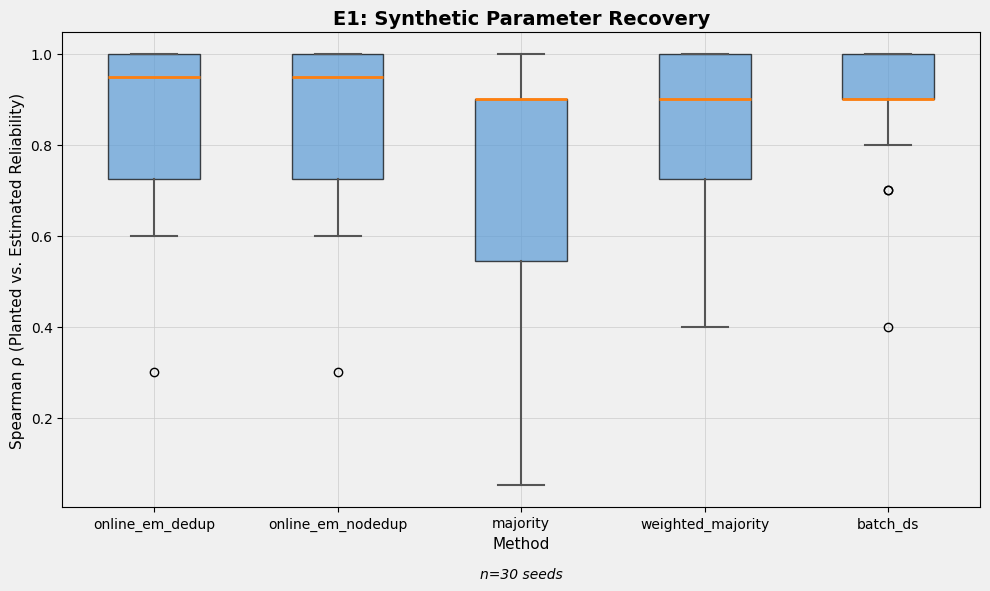

<p align="center"></p>

<h1 align="center">stapled-news</h1>

<p align="center"><strong>Treat news outlets as noisy raters of a hidden truth, then estimate both at once.</strong></p>

<p align="center">Dominik Mattioli</p>

<p align="center">
<a href="https://github.com/domattioli/stapled-news/actions/workflows/ci.yml"></a>
<a href="https://www.python.org/"></a>
<a href="LICENSE.md"></a>
<a href="https://domattioli.github.io/stapled-news/"></a>
<a href="CITATION.cff"></a>
</p>

## Table of Contents

- [1. Status & Roadmap](#1-status--roadmap)
- [2. The idea](#2-the-idea)
- [3. Installation](#3-installation)
- [4. Quick start](#4-quick-start)
- [5. Pipeline and stage gates](#5-pipeline-and-stage-gates)
- [6. Commands](#6-commands)
- [7. Configuration](#7-configuration)
- [8. Data model and output](#8-data-model-and-output)
- [9. Atomic consensus (planned evaluation)](#9-atomic-consensus-planned-evaluation)
- [10. Testing](#10-testing)
- [11. Limitations](#11-limitations)
- [12. Project structure](#12-project-structure)
- [13. Troubleshooting](#13-troubleshooting)
- [14. Citation](#14-citation)

## 1. Status & Roadmap

Research MVP, version 0.1.0. Synthetic recovery is the validated path; real-data inference is gated behind it in code (see [Stage gates](#5-pipeline-and-stage-gates)). A US-headline consensus-distance study is live at [domattioli.github.io/stapled-news](https://domattioli.github.io/stapled-news/), built from a corpus that accretes daily on the `development` branch. Next: the atomic-consensus annotation program (20 pilot + 80 held-out events), planned but not started. Longer list: [`docs/FUTURE_WORK.md`](docs/FUTURE_WORK.md).

<div align="right"><a href="#stapled-news"><sub>^ Back to top</sub></a></div>

## 2. The idea

When many outlets cover one event, their accounts overlap imperfectly. STAPLE (Warfield et al. 2004) solves the same shape of problem in medical imaging: several raters, no ground truth, jointly estimate the hidden segmentation and each rater's accuracy. Here the event is the hidden object, outlets are the raters, and claims are what each outlet includes or omits.

The engine is Dawid-Skene EM over binary claims. Each outlet gets a sensitivity and specificity; each event gets a posterior state. Extras: certainty tempering, label-switching detection, degeneracy checks. An online variant (Cappé-Moulines stepwise EM, Robbins-Monro step (t+2)^-0.6) runs in one constant-memory pass over an HTTP-Range CSV stream with resumable byte cursors.

The estimand is *consensus*, not truth. Unsupervised inference cannot tell a reliable majority from an unreliable one; the software is honest about that in its outputs. Because the method is fragile against self-deception, the repo first proves it can recover planted parameters from synthetic corpora before it is allowed to touch real articles.

<div align="right"><a href="#stapled-news"><sub>^ Back to top</sub></a></div>

## 3. Installation

Python 3.11+. Core deps: typer, numpy, scipy, jinja2, pyyaml, matplotlib, scikit-learn. Dev: pytest, ruff.

```bash
git clone https://github.com/domattioli/stapled-news
cd stapled-news
python3 -m venv .venv && source .venv/bin/activate
pip install -e ".[dev]"
```

<div align="right"><a href="#stapled-news"><sub>^ Back to top</sub></a></div>

## 4. Quick start

Validate the method on synthetic data. No real articles involved.

```bash
stapled synth generate --config configs/synth-baseline.yml --seed 42
stapled synth validate --corpus 1
stapled infer --synthetic --corpus 1
stapled score --run 1
stapled export --run 1 --out docs/
```

Expected with `configs/synth-baseline.yml`, seed 42 (2–5 min on typical hardware):

| Metric | Expected |
|---|---|
| State accuracy | ≥ 85% |
| Reliability rank correlation (Spearman) | ≥ 0.8 |
| Liar outlet (`tabloid-mirror`, seeded reliability 0.1) | ranks last |
| Recovery verdict | **PASS** |

<div align="right"><a href="#stapled-news"><sub>^ Back to top</sub></a></div>

## 5. Pipeline and stage gates

```
RSS feeds → articles → claims → event alignment
                                      ↓
                        synthetic corpus generation
                                      ↓
                 corpus validation (chi-squared, vocab, bias)
                                      ↓
                        EM inference (Dawid-Skene)
                                      ↓
              recovery scoring (accuracy, rank correlation)
                                      ↓
              stage gate: real data blocked until PASS
                                      ↓
                  static site export → GitHub Pages
```

Two gates, enforced in code, never bypassed by documentation:

1. **Corpus validation gate.** `infer --synthetic` requires a corpus with status PASSED; `infer --real` requires a synthetic recovery verdict of PASS.
2. **Export gate.** A run exports only if status is `converged` and, for synthetic runs, recovery is PASS.

<div align="right"><a href="#stapled-news"><sub>^ Back to top</sub></a></div>

## 6. Commands

```bash
stapled synth generate --config FILE --seed N   # generate synthetic corpus
stapled synth validate --corpus ID              # chi-squared, vocab, bias checks
stapled infer --synthetic --corpus ID           # EM (gated on corpus PASSED)
stapled infer --real --event-ids 1,2,3          # real-data EM (gated on recovery PASS)
stapled score --run ID                          # score run vs. seeded ground truth
stapled export --run ID --out docs/             # static HTML + JSON
stapled status                                  # database state + gate status
stapled --version | --help
```

Further commands exist for corpus loaders (`load-isot`, `load-fakenewsnet`, `load-uci`, `load-us-headlines`, `load-frontpages`), streaming training (`train-stream`, `train-report`), and the `atomic` subcommand group. `stapled --help` lists them.

<div align="right"><a href="#stapled-news"><sub>^ Back to top</sub></a></div>

## 7. Configuration

Synthetic corpus (`configs/synth-baseline.yml`):

```yaml
outlets:
  - name: "reliable-press"
    reliability: 0.9    # P(outlet reports correctly), [0, 1]
    bias: -0.1          # direction/magnitude of systematic error, [-1, 1]
    calibration: 1.0    # how well stated certainty matches accuracy, (0, inf)
n_events: 20
articles_per_event_per_outlet: 1
```

Baseline seeds reliabilities from 0.1 to 0.9. `configs/feeds.yml` (`name` + `feed_url` per outlet) is a placeholder for real RSS ingestion, outside MVP scope.

<div align="right"><a href="#stapled-news"><sub>^ Back to top</sub></a></div>

## 8. Data model and output

Single-file SQLite, `stapled.db` (git-ignored):

| Table | Holds |
|---|---|
| `outlet` | sources with reliability, bias, calibration estimates |
| `article` | raw or synthetic texts |
| `claim` | actor-action-object assertions with framing metadata |
| `event` | disputed assertions with inferred true states |
| `corpus` | synthetic datasets with seeded ground-truth parameters |
| `inference_run` | immutable EM execution records |
| `run_event_result` | inferred state, confidence, corroboration label per event per run |
| `run_outlet_result` | estimated reliability, bias, calibration per outlet per run |
| `recovery_report` | inference vs. ground truth score (synthetic only) |

`stapled export` writes `run.html` (events, confidence, corroboration, outlet parameters), `index.html` (run directory), and `run.json` (events, outlets, gates). Output is committed to `docs/` and deployed to GitHub Pages on push to `main`.

<div align="right"><a href="#stapled-news"><sub>^ Back to top</sub></a></div>

## 9. Atomic consensus (planned evaluation)

A deterministic pipeline (`stapled atomic extract | match | summarize | profile | annotate | evaluate`) breaks event headlines into small auditable propositions and reports how often independent reporting groups, stratified by a declared left/center/right panel, mention each one. It measures *reported agreement*: it does not establish truth, grade outlet quality, or infer claims absent from every sampled headline. Spec: [`specs/005-atomic-consensus/spec.md`](specs/005-atomic-consensus/spec.md). Annotation protocol (20 pilot events, 80 frozen held-out, two annotators plus an adjudicator): [`docs/ATOMIC_ANNOTATION_GUIDE.md`](docs/ATOMIC_ANNOTATION_GUIDE.md). No annotations or metrics recorded yet.

<div align="right"><a href="#stapled-news"><sub>^ Back to top</sub></a></div>

## 10. Testing

```bash
pytest                                   # everything
pytest tests/unit -q                     # unit
pytest tests/integration -q              # integration
pytest tests/integration -k recovery     # recovery pipeline (SC-001..003, SC-006)
```

CI (`.github/workflows/ci.yml`): ruff + pytest on push and PR to `main`/`development`.

<div align="right"><a href="#stapled-news"><sub>^ Back to top</sub></a></div>

## 11. Limitations

- **Bias and reliability estimates are model artifacts, not editorial judgments.** They describe correlation patterns in a corpus under a noisy-annotator model. They do not imply malice, intentional distortion, or bias in a normative sense. Interpret with domain expertise.
- **Consensus is not accuracy.** A unanimous, wrong panel is indistinguishable from a unanimous, right one without external anchors. An anchoring mechanism exists; it is only as good as the anchors supplied.
- **Syndication inflates votes.** Verbatim wire copy makes one account look like many. Near-duplicate clustering collapses exact copies; lightly edited copies still slip through.
- **Research scale only.** Hundreds of articles, tens of outlets, dozens of events. Not a production monitoring service.
- **Real-data inference is gated, not proven.** The synthetic recovery PASS shows the estimator recovers planted parameters; it does not show real outlets behave like the synthetic model.
- **Atomic consensus is unevaluated.** The pipeline runs; its precision, recall, and coverage are unknown until the annotation ledger exists.

<div align="right"><a href="#stapled-news"><sub>^ Back to top</sub></a></div>

## 12. Project structure

```
src/stapled/
├── cli.py          # typer CLI
├── db.py           # SQLite schema + migrations
├── gates.py        # stage gates
├── infer/          # EM engine (batch em.py, online_em.py, atomic_em.py)
├── synth/          # synthetic generation + validation
├── recover/        # recovery scoring
├── ingest/         # CSV/RSS/ISOT/FakeNewsNet/UCI loaders, HTTP-Range streaming, dedup
├── align/          # event clustering (TF-IDF, embeddings)
├── extract/        # claim, framing, atomic-proposition extraction
├── analyze/        # consensus distance, panel, atomic-consensus modules
├── experiments/    # e1 recovery … e7 consensus distance
├── export/         # static site rendering (Jinja2)
└── viz/            # charts, online convergence plots
tests/unit, tests/integration
.github/workflows/  ci.yml · pages.yml · fetch-us-news.yml · atomic-consensus.yml
```

<div align="right"><a href="#stapled-news"><sub>^ Back to top</sub></a></div>

## 13. Troubleshooting

- **Recovery below threshold.** Check seed variability and the reliability spread in the config; baseline is seed 42, reliabilities 0.1–0.9.
- **Corpus validation fails.** Articles need diverse vocabularies and outlets need varied outcomes. A degenerate corpus (all outlets identical) is rejected.
- **EM does not converge.** Large uncertainty or conflicting claims. Raise `max_iter` in `RunConfig` or inspect the outlet parameter seeds.

<div align="right"><a href="#stapled-news"><sub>^ Back to top</sub></a></div>

## 14. Citation

```bibtex
@software{mattioli_stapled_news_2026,
  author  = {Mattioli, Dominik},
  title   = {stapled-news},
  version = {0.1.0},
  url     = {https://github.com/domattioli/stapled-news}
}
```

Machine-readable metadata: [`CITATION.cff`](CITATION.cff). No DOI minted yet.

Methodological inspiration (cite this software directly, not these as stand-ins):

- Warfield, S. K., Zou, K. H., Wells, W. M. (2004). Simultaneous Truth and Performance Level Estimation (STAPLE). *IEEE Trans. Med. Imaging*, 23(7), 903–921.
- Dawid, A. P., Skene, A. M. (1979). Maximum Likelihood Estimation of Observer Error-Rates Using the EM Algorithm. *Applied Statistics*, 28(1), 20–28.
- Nenkova, A., Passonneau, R. (2004). Evaluating Content Selection in Summarization: The Pyramid Method. *HLT-NAACL 2004*, 145–152.

License: [PolyForm Noncommercial 1.0.0](LICENSE.md).

<div align="right"><a href="#stapled-news"><sub>^ Back to top</sub></a></div>
